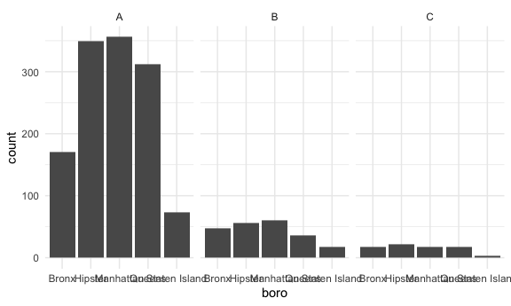

Data Wrangling II
================

## Restaurant inspections

``` r
api_url = "https://data.cityofnewyork.us/resource/43nn-pn8j.csv"

rest_inspections = 
  GET(api_url, query = list("$limit" = 50000)) %>% 
  content("parsed")
```

    ## Parsed with column specification:
    ## cols(
    ##   .default = col_character(),
    ##   camis = col_double(),
    ##   inspection_date = col_datetime(format = ""),
    ##   score = col_double(),
    ##   grade_date = col_datetime(format = ""),
    ##   record_date = col_datetime(format = ""),
    ##   latitude = col_double(),
    ##   longitude = col_double(),
    ##   community_board = col_double(),
    ##   bin = col_double(),
    ##   bbl = col_double()
    ## )

    ## See spec(...) for full column specifications.

``` r
rest_inspections %>% 
  count(boro, grade) %>% 
  pivot_wider(names_from = grade, values_from = n)
```

    ## # A tibble: 6 x 8
    ##   boro              A     B     Z  `NA`     C     N     P
    ##   <chr>         <int> <int> <int> <int> <int> <int> <int>
    ## 1 0                12     1     1    10    NA    NA    NA
    ## 2 Bronx          1726   423    23  2144   138    16    31
    ## 3 Brooklyn       4872   846    40  6245   309    77    95
    ## 4 Manhattan      8053  1191    57  9942   491   112   116
    ## 5 Queens         4722   706    46  5503   287    71    69
    ## 6 Staten Island   675    97     5   803    28     8     9

``` r
rest_inspections =
  rest_inspections %>% 
  filter(grade %in% c("A", "B", "C"), boro != "0")
```

Let’s look at pizza places.

``` r
rest_inspections %>% 
  mutate(dba = str_to_upper(dba)) %>% 
  filter(str_detect(dba, "PIZZ"))
```

    ## # A tibble: 1,555 x 26
    ##     camis dba   boro  building street zipcode phone cuisine_descrip…
    ##     <dbl> <chr> <chr> <chr>    <chr>  <chr>   <chr> <chr>           
    ##  1 4.14e7 SOFI… Broo… 2822     CONEY… 11235   7185… Pizza           
    ##  2 5.01e7 ROUN… Stat… 1957     VICTO… 10314   7185… Pizza/Italian   
    ##  3 5.01e7 BRAV… Manh… 360      7 AVE… 10001   2122… American        
    ##  4 4.13e7 JOHN… Broo… 5806     5 AVE… 11220   7184… Pizza/Italian   
    ##  5 4.09e7 THE … Quee… 60-48    MYRTL… 11385   7183… Pizza/Italian   
    ##  6 5.00e7 J & … Broo… 5507     5 AVE… 11220   7184… Pizza           
    ##  7 5.01e7 J & … Quee… 4013     82ND … 11373   7184… Spanish         
    ##  8 5.00e7 NY P… Quee… 91-14    SUTPH… 11435   7186… American        
    ##  9 5.01e7 BIG … Stat… 4069     HYLAN… 10308   7183… Pizza/Italian   
    ## 10 5.00e7 MAMA… Stat… 2146     FORES… 10303   7188… Pizza/Italian   
    ## # … with 1,545 more rows, and 18 more variables: inspection_date <dttm>,
    ## #   action <chr>, violation_code <chr>, violation_description <chr>,
    ## #   critical_flag <chr>, score <dbl>, grade <chr>, grade_date <dttm>,
    ## #   record_date <dttm>, inspection_type <chr>, latitude <dbl>, longitude <dbl>,
    ## #   community_board <dbl>, council_district <chr>, census_tract <chr>,
    ## #   bin <dbl>, bbl <dbl>, nta <chr>

``` r
rest_inspections %>% 
  mutate(dba = str_to_upper(dba)) %>% 
  filter(str_detect(dba, "PIZZ")) %>% 
  count(boro, grade) %>% 
  pivot_wider(names_from = grade, values_from = n)
```

    ## # A tibble: 5 x 4
    ##   boro              A     B     C
    ##   <chr>         <int> <int> <int>
    ## 1 Bronx           171    47    17
    ## 2 Brooklyn        349    56    21
    ## 3 Manhattan       356    60    18
    ## 4 Queens          312    36    18
    ## 5 Staten Island    73    18     3

``` r
rest_inspections %>% 
  mutate(dba = str_to_upper(dba)) %>% 
  filter(str_detect(dba, "PIZZ")) %>% 
  mutate(
    boro = fct_infreq(boro),
    boro = str_replace(boro, "Brooklyn", "Hipster")) %>% 
  ggplot(aes(x = boro)) + 
  geom_bar() +
  facet_wrap(. ~ grade)
```


